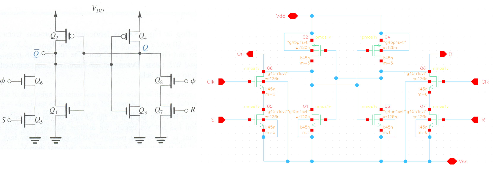
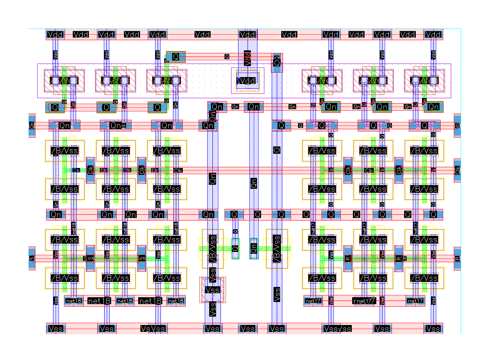

# SR Flip-Flop
## Project Overview
The goal of this assignment for the *"Design of VLSI Systems"* course was to design, analyze, and implement an SR Flip-Flop at the transistor level using Cadence Virtuoso. The project involved schematic design, simulation, and physical layout (Place and Route) of the circuit.

## Schematic Design
- Implemented an SR Flip-Flop circuit using nmos1v and pmos1v transistors
- Transistor sizing details and rationale
- Schematic capture in Cadence Virtuoso

## Simulations
- Functional verification of the SR Flip-Flop
- Temperature variation analysis (-40°C to 125°C)
- Supply voltage variation analysis
- Performance metrics (rise time, fall time, propagation delay)

## Layout Design
- Transistor placement strategy
- Routing techniques using metal1 and metal2 layers
- Power rail design
- Substrate and well connections

## Verification
- Design Rule Check (DRC) results
- Layout vs. Schematic (LVS) verification results