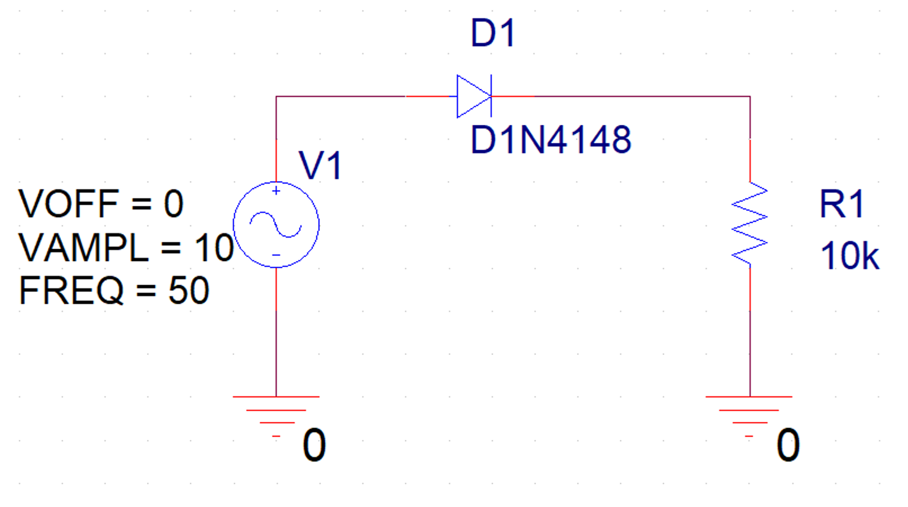
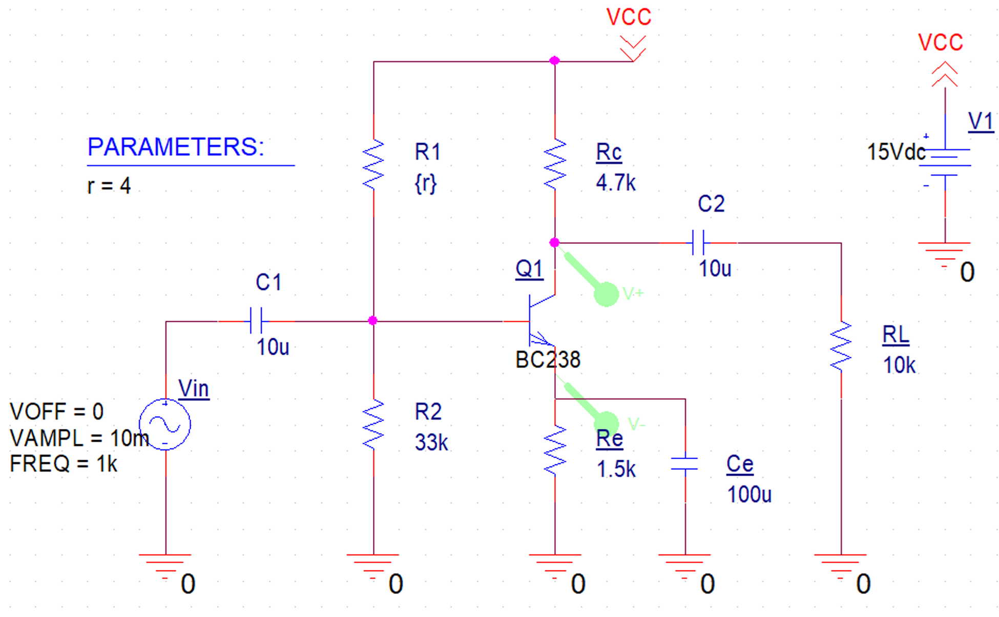
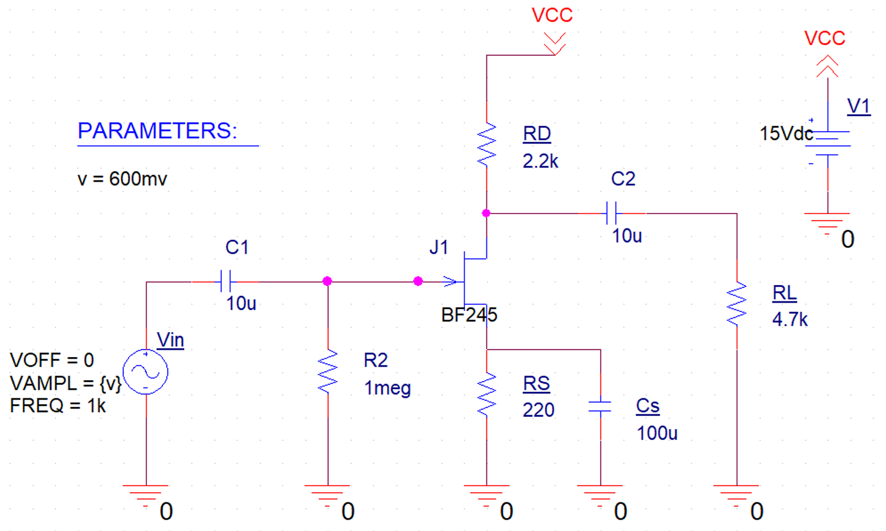

# Electronics I 
This README provides an overview of three exercises for the *"Electronics I"* course. These exercises focus on fundamental electronic components and circuits, providing hands-on experience with simulation and analysis in SPICE.

## Exercises

### 1. Semiconductor Diode
This exercise explores the characteristics and behavior of semiconductor diodes.

Key Tasks:
1. Plot input and output voltage observing diode behavior
2. Repeat the analysis for different temperatures
3. Graph the power consumed by the load
4. Use DC Sweep to plot the diode's characteristic curve

Learning Outcomes:
- Understanding diode voltage drop
- Observing temperature effects on diode behavior
- Analyzing power consumption in diode circuits
- Familiarity with diode characteristic curves

### 2. Bipolar Transistor - Biasing, Switching, and Amplification
This exercise focuses on bipolar transistors and their various operating modes.

Key Tasks:
1. Use parametric analysis to find R1 value for VCE = VCC / 2
2. Plot input and output voltage waveforms
3. Analyze the effect of changing the simulation start time
4. Calculate the exact voltage gain of the circuit
5. Plot the frequency response of the circuit in dB
6. Graph the input impedance as a function of frequency
7. Use DC Sweep to plot the transistor's characteristic curve

Learning Outcomes:
- Understanding transistor biasing
- Analyzing transistor amplifier circuits
- Interpreting frequency response and gain
- Exploring input impedance characteristics
- Familiarity with transistor characteristic curves

### 3. Field-Effect Transistor (FET) and Applications
This exercise explores the characteristics and applications of Field-Effect Transistors.

Key Tasks:
1. Determine the maximum input amplitude without signal distortion
2. Plot input and output voltage waveforms
3. Analyze the effect of changing the simulation start time
4. Calculate the exact voltage gain of the circuit
5. Plot the frequency response of the circuit in dB
6. Graph the input impedance as a function of frequency
7. Use DC Sweep to plot the transistor's characteristic curve

Learning Outcomes:
- Understanding FET behavior and limitations
- Analyzing FET amplifier circuits
- Interpreting frequency response and gain in FET circuits
- Exploring input impedance characteristics of FET circuits
- Familiarity with FET characteristic curves