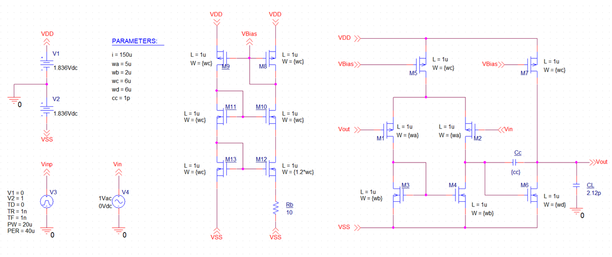

# Operational Amplifier Design
## Project Overview
This repository contains the materials for the Operational Amplifier (Op-Amp) design assignment in the *"Electronics III"* course. The project aims to introduce students to integrated circuit design through a practical application.

## Project Goals
1. Gain hands-on experience in integrated circuit design
2. Apply theoretical knowledge to a practical design challenge
3. Understand the iterative nature of circuit optimization
4. Learn to balance multiple performance parameters in analog design

## Methodology
The project consists of three main phases:
1. Theoretical Design (MATLAB)
    - Develop a MATLAB script to calculate initial circuit parameters
    - Use simplified equations to estimate transistor sizes and biasing
    - Establish a starting point for practical implementation
2. Circuit Implementation (OrCAD)
    - Transfer theoretical design to OrCAD schematic capture
    - Set up the circuit with initial values from MATLAB calculations
    - Prepare the environment for various simulation types
3. Circuit Optimization (OrCAD SPICE)
    - Conduct iterative simulations to fine-tune circuit performance
    - Adjust transistor sizes and biasing to meet all specifications
    - Balance trade-offs between different performance metrics

## Design Process
1. Architecture Selection: Choose between P-MOS and N-MOS input stages
2. Gain and Bandwidth Optimization:
    - Use AC Sweep simulations
    - Adjust transistor sizes and biasing currents
3. Slew Rate Improvement:
    - Perform transient analysis
    - Optimize compensation capacitor and bias current
4. Power Consumption Reduction:
    - Measure the total current draw
    - Fine-tune biasing to minimize power while maintaining performance
5. Offset Minimization:
    -Analyze DC operating point
    -Adjust differential pair and current mirror matching
6. Current Source Implementation:
    - Replace the ideal current source with a practical circuit
    - Design and optimize a cascode Widlar current mirror

## Key Learnings
- Bridging the gap between theoretical calculations and practical implementation
- Understanding the impact of temperature on analog circuit performance
- Mastering the use of parametric simulations for circuit optimization
- Appreciating the interdependence of various performance parameters in Op-Amp design