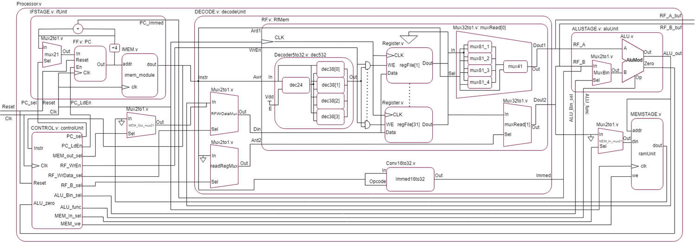

# Digital Systems Processor Project

## Overview
This project implements a custom processor design using Verilog HDL that can execute a given instruction set architecture as part of a *"Low-level HW Digital Systems I"* course.

## Key Components
- ALU (Arithmetic Logic Unit)
- Register File
- Instruction Fetch Stage
- Decode Stage
- Memory Stage
- Control Unit

## Architecture

The processor follows a multi-cycle architecture with the following main stages:
- Instruction Fetch (IF)
- Decode
- Execute (ALU)
- Memory Access
- Write Back

## Features
- 32-bit data path
- Support for arithmetic, logical, memory, and branch instructions
- Parameterized design for flexibility
- Testbenches for individual modules

## Tools Used

- Xilinx ISE for synthesis and simulation
- Verilog HDL for hardware description

## Project Structure
- ALU.v: Arithmetic Logic Unit implementation
- RF.v: Register File implementation
- IFSTAGE.v: Instruction Fetch stage
- DECODE.v: Instruction Decode stage
- ALUSTAGE.v: ALU stage wrapper
- MEMSTAGE.v: Memory access stage
- CONTROL.v: Control Unit implementation
- Processor.v: Top-level module connecting all components
- *_tb.v: Testbench files for the modules
