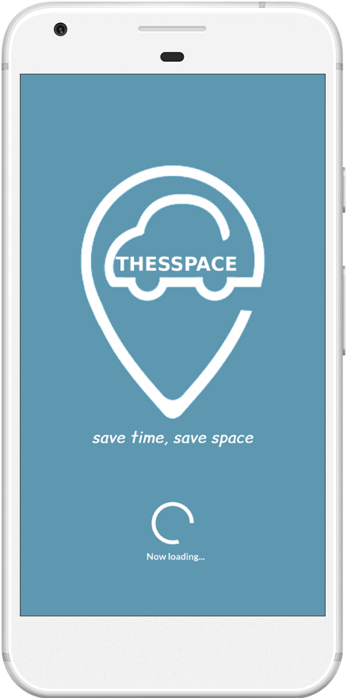

# ThesSpace
This repository contains files of the *"Software Engineering"* course assignment.

## Assignment Goals
The primary objective of this assignment is to apply software engineering principles and methodologies to design a complex software system. Through this project, students were expected to:
- Analyze and document user requirements for a real-world application
- Create detailed system specifications based on these requirements
- Design and model the system architecture using UML diagrams
- Develop use case scenarios to capture system behavior
- Create user interface mockups to visualize the application
- Practice teamwork and collaboration in a software development context

## Project Overview
Our team designed ThesSpace, a smart parking management system. This project serves as a vehicle to demonstrate our understanding and application of software engineering concepts.

## Repository Contents
This repository includes the following deliverables:
- Use Case Scenarios and Diagrams
- User Interface Mockups
- Static Modeling (UML Class Diagrams)

## Key Learning Outcomes
Through this assignment, we've gained practical experience in:
- Requirements gathering and analysis
- System design and architecture
- UML modeling
- User interface design
- Documentation in software development
- Applying software engineering methodologies

## User Interface Mockup

