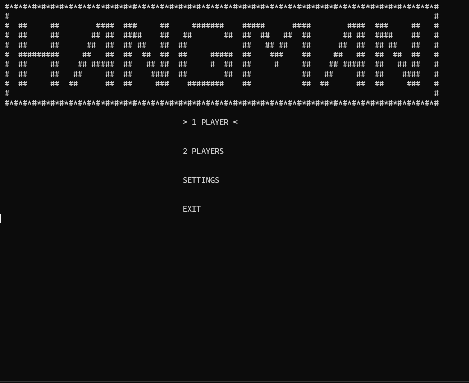
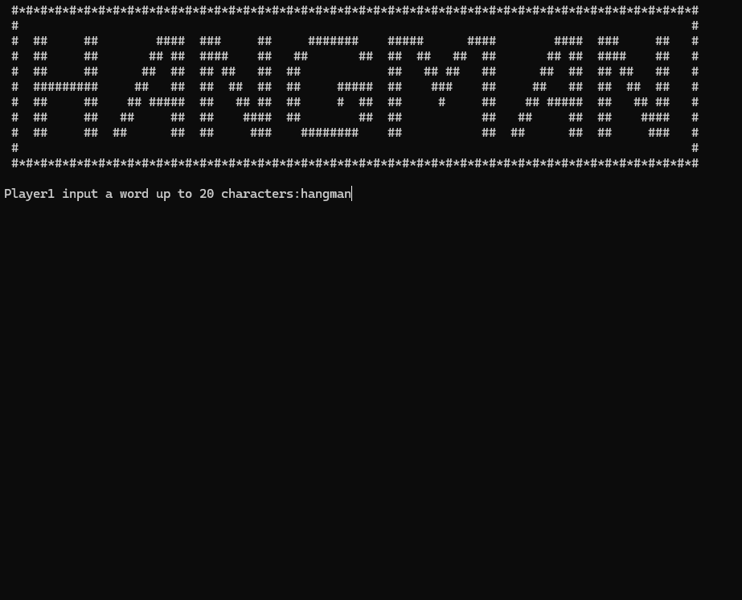
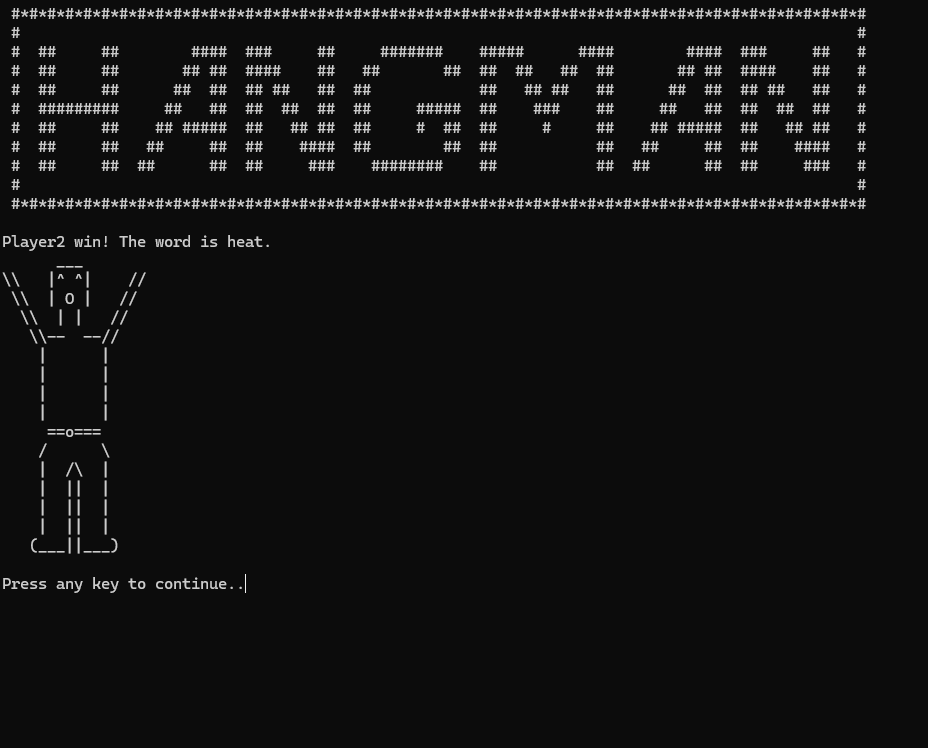
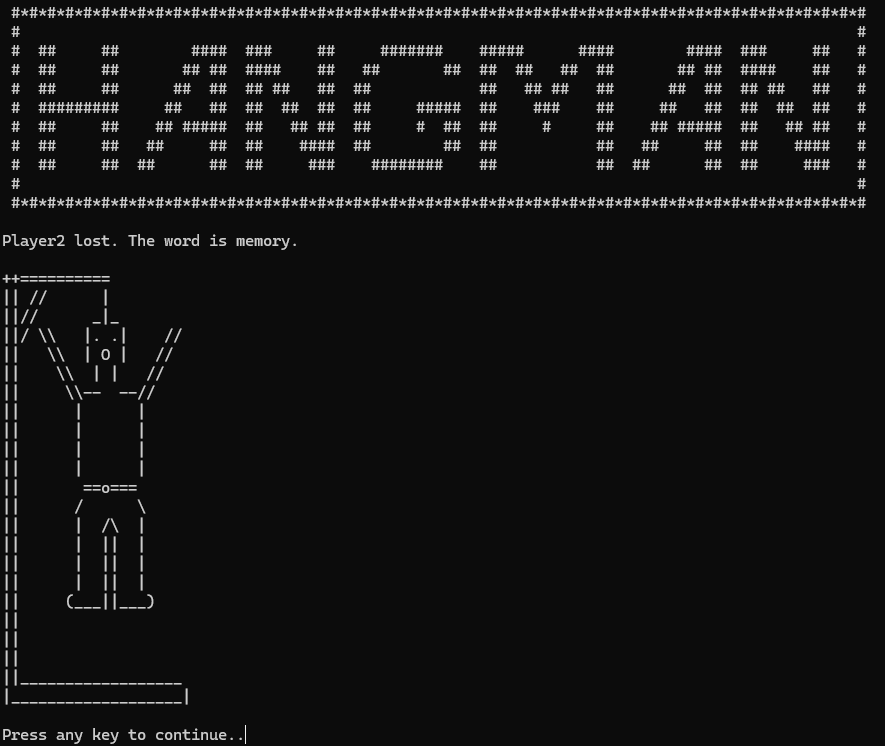

# Hangman Console Game

This repository is a console-based hangman game written in C, written for the subject *"Structured Programming"* as an exercise for basic C programming. The game allows two players to play, where one player enters a word, and the other has to guess it character by character. The game also has an option for selecting a random word from a predefined list file.

## Features
- Two-player mode: One player inputs the word while the other player guesses.
- Random word mode: A word is selected randomly from a predefined list (words.txt).
- Limited attempts: Player 2 has six attempts to guess the word before losing.
- Word input validation: Ensures words are no longer than 20 characters.

## How to Play
- **Random Word Mode:** The game picks a random word from the words.txt file for Player 2 to guess.
- **Manual Input Mode:** Player 1 inputs a word up to 20 characters, and Player 2 must guess it.
- Player 2 guesses one character at a time. If the character is correct, then it is revealed in the word. If incorrect, Player 2 loses one life.
- The game ends when Player 2 guesses the word or runs out of lives.

## Controls
- **Arrow keys** for navigation in the menu.
- **Character input** for guessing letters.
- **ESC key** to return to the main menu during gameplay.

## Screenshots
|  |  |
| - | - |
|  |  |